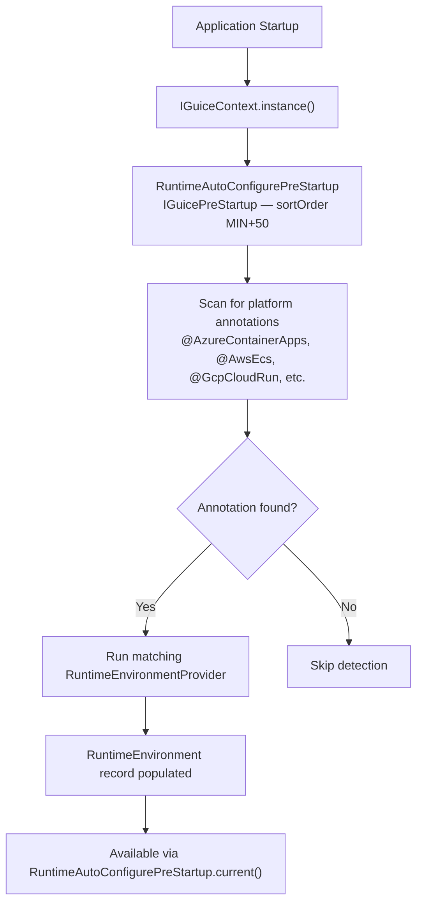
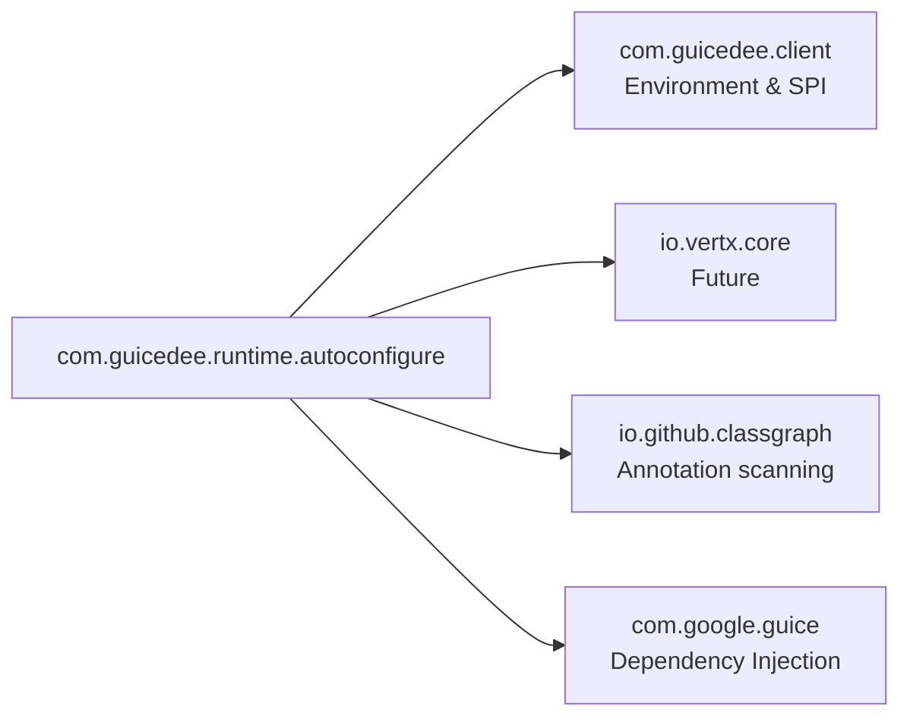

# GuicedEE Runtime Autoconfigure

[](https://github.com/GuicedEE/RuntimeAutoconfigure/actions/workflows/build.yml)
[](https://github.com/GuicedEE/RuntimeAutoconfigure)
[](https://www.apache.org/licenses/LICENSE-2.0)


Cloud runtime detection for GuicedEE. Detects the running platform and provides environment defaults that integrate with all GuicedEE modules — service discovery, health, Consul, REST client endpoints, and more.

Built on [Google Guice](https://github.com/google/guice) · [Vert.x 5](https://vertx.io/) · JPMS module `com.guicedee.runtime.autoconfigure` · Java 25+

## 📦 Installation

```xml
<dependency>
  <groupId>com.guicedee</groupId>
  <artifactId>runtime-autoconfigure</artifactId>
</dependency>
```

One dependency — all cloud providers included.

## ✨ Features

- **Auto-detection** — detects cloud platform from environment variables at startup
- **@CloudRuntimeOptions** — annotation-driven configuration following the GuicedEE pattern
- **14 built-in providers** — Azure (Container Apps, App Service), AWS (ECS, Lambda, App Runner, Elastic Beanstalk), GCP (Cloud Run, App Engine), DigitalOcean, Fly.io, Railway, Render, Heroku, Kubernetes
- **Override-friendly** — env vars > annotation > cloud-detected > framework default
- **Pluggable** — `RuntimeEnvironmentProvider` SPI for custom platforms
- **Zero config** — just add the dependency, detection is automatic
- **JPMS-modular** — proper module-info with exports, uses, and provides

## 🚀 Quick Start

### Zero-config (auto-detect)

Just add the dependency. GuicedEE detects the platform at startup:

```java
RuntimeAutoConfigurePreStartup.current().ifPresent(env -> {
    String serviceName = env.serviceName();
    String hostname = env.hostname();
    int port = env.port();
    String fqdn = env.fqdn();
});
```

### Annotation-driven

```java
@CloudRuntimeOptions(
    preferredProvider = "azure-container-apps",
    defaultPort = 8080,
    healthPath = "/health/ready",
    autoConfigureResolver = true
)
package com.myapp;

import com.guicedee.runtime.autoconfigure.CloudRuntimeOptions;
```

### Environment variable overrides

```bash
# Disable detection entirely
CLOUD_RUNTIME_ENABLED=false

# Force a specific provider
CLOUD_RUNTIME_PREFERRED_PROVIDER=gcp-cloud-run

# Override detected values
CLOUD_RUNTIME_SERVICE_NAME=my-custom-name
CLOUD_RUNTIME_HOSTNAME=custom.host.com
CLOUD_RUNTIME_PORT=9090
CLOUD_RUNTIME_REGION=eu-west-1
```

## 🔌 Built-in Providers

| Provider ID | Platform | Detection |
|---|---|---|
| `azure-container-apps` | Azure Container Apps | `CONTAINER_APP_NAME` + `CONTAINER_APP_ENV_DNS_SUFFIX` |
| `azure-app-service` | Azure App Service | `WEBSITE_SITE_NAME` (without `CONTAINER_APP_NAME`) |
| `aws-ecs` | AWS ECS / Fargate | `ECS_CONTAINER_METADATA_URI_V4` or `ECS_CONTAINER_METADATA_URI` |
| `aws-lambda` | AWS Lambda | `AWS_LAMBDA_FUNCTION_NAME` (without ECS metadata) |
| `aws-app-runner` | AWS App Runner | `AWS_APP_RUNNER_SERVICE_NAME` |
| `aws-elastic-beanstalk` | AWS Elastic Beanstalk | `AWS_ELASTIC_BEANSTALK_ENVIRONMENT_NAME` |
| `gcp-cloud-run` | Google Cloud Run | `K_SERVICE` + `K_REVISION` |
| `gcp-app-engine` | Google App Engine | `GAE_APPLICATION` (without Cloud Run vars) |
| `digitalocean-app-platform` | DigitalOcean App Platform | `DIGITALOCEAN_APP_NAME` |
| `fly-io` | Fly.io | `FLY_APP_NAME` |
| `railway` | Railway | `RAILWAY_SERVICE_NAME` |
| `render` | Render | `RENDER_SERVICE_NAME` or `RENDER` |
| `heroku` | Heroku | `DYNO` |
| `kubernetes` | Generic Kubernetes | `KUBERNETES_SERVICE_HOST` (lowest priority) |

## 📐 Merge Rule

```
explicit env var (CLOUD_RUNTIME_*)
  > @CloudRuntimeOptions annotation override
  > cloud-detected value
  > framework default
```

## ⚙️ @CloudRuntimeOptions

| Property | Default | Purpose |
|---|---|---|
| `value` | `"default"` | Logical name for env var lookups |
| `preferredProvider` | `""` | Force a specific provider |
| `enabled` | `true` | Disable detection entirely |
| `defaultPort` | `8080` | Fallback port when none detected |
| `healthPath` | `"/health/ready"` | Health check path for registration |
| `autoRegisterConsul` | `false` | Auto-register with Consul |
| `autoConfigureResolver` | `true` | Auto-configure service resolver |
| `serviceName` | `""` | Override service name |
| `hostname` | `""` | Override hostname |
| `port` | `0` | Override port (0 = use detected) |
| `region` | `""` | Override region |

## 📐 Architecture



## 🧩 Integration with Service Discovery

When using `com.guicedee:service-discovery`, set type to `"auto"`:

```java
@ServiceResolverOptions(
    value = "my-service",
    type = "auto"
)
package com.myapp.clients;
```

The auto resolver checks the detected runtime and selects the best resolution strategy.

## 🧩 Custom Provider

```java
public class MyCloudProvider implements RuntimeEnvironmentProvider {

    @Override
    public boolean detected() {
        return EnvironmentUtils.has("MY_CLOUD_APP_NAME");
    }

    @Override
    public RuntimeEnvironment runtimeEnvironment() {
        return new RuntimeEnvironment(
            "my-cloud", EnvironmentUtils.env("MY_CLOUD_APP_NAME", ""),
            "", "", EnvironmentUtils.envInt("PORT", 8080),
            "", "", "", "", Map.of()
        );
    }

    @Override
    public String providerId() { return "my-cloud"; }

    @Override
    public Integer sortOrder() { return 100; }
}
```

Register in `module-info.java`:
```java
provides RuntimeEnvironmentProvider with MyCloudProvider;
```

## 🗺️ Module Graph



## 🏗️ Key Classes

| Class | Package | Role |
|---|---|---|
| `RuntimeEnvironment` | `autoconfigure` | Immutable record holding detected cloud metadata |
| `RuntimeEnvironmentProvider` | `autoconfigure` | SPI for cloud platform detection |
| `CloudRuntimeOptions` | `autoconfigure` | Annotation for configuring detection behavior |
| `CloudProvider` | `autoconfigure` | Enum of known cloud providers |
| `AzureContainerApps` | `autoconfigure` | Marker annotation for Azure Container Apps |
| `Kubernetes` | `autoconfigure` | Marker annotation for generic Kubernetes |
| `RuntimeAutoConfigurePreStartup` | `implementations` | Pre-startup hook that runs detection |
| `AzureContainerAppsEnvironmentProvider` | `providers` | Azure Container Apps detector |
| `AwsEcsEnvironmentProvider` | `providers` | AWS ECS/Fargate detector |
| `GcpCloudRunEnvironmentProvider` | `providers` | Google Cloud Run detector |
| `KubernetesEnvironmentProvider` | `providers` | Generic Kubernetes detector |
| `AbstractEnvironmentProvider` | `providers` | Base class with env var helpers |

## 🧩 JPMS

Module name: **`com.guicedee.runtime.autoconfigure`**

```java
module my.app {
    requires com.guicedee.runtime.autoconfigure;
}
```

## 🤝 Contributing

Issues and pull requests are welcome — please add tests for new cloud providers or configuration features.

## 📄 License

[Apache 2.0](https://www.apache.org/licenses/LICENSE-2.0)
